# Étape 1 — Compte-rendu des manipulations Kubernetes

**Équipe** : Marius FRANCK (marius.franck@uphf.fr), Simon CARPENTIER (simon.carpentier@uphf.fr)  
**Date** : 18 mai 2026  
**Environnement** : Windows, Docker Desktop 28.5.1, Minikube v1.38.1 (driver `docker`), kubectl v1.34.1

Les captures d’écran sont intégrées ci-dessous pour chaque question.

> **Pour voir les images** : ouvrir l’**aperçu Markdown** avec `Ctrl+Shift+V` (pas l’éditeur brut).  
> Si une image ne charge pas : `Ctrl+Shift+P` → *Markdown: Open Preview* → accepter l’affichage des fichiers locaux si Cursor le demande.

---

## Gestion de Minikube

### (1) Minikube pointe-t-il correctement vers Docker ?

Nous avons vérifié le profil actif avec `minikube profile list` : le driver est bien **docker**, le runtime aussi. Docker Desktop répond correctement (`docker --version` → 28.5.1). Le cluster est opérationnel.

```text
$ minikube profile list
│ PROFILE  │ DRIVER │ RUNTIME │      IP        │ VERSION │ STATUS │
│ minikube │ docker │ docker  │ 192.168.49.2   │ v1.35.1 │ OK     │
```


<p><strong>Question 1 — Vérification du driver Docker (minikube profile list)</strong></p>
<p>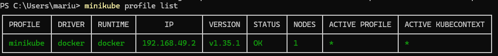</p>


---

### (2) Addons actuellement installés

À l’origine, seuls `default-storageclass` et `storage-provisioner` étaient activés. Les autres addons (dashboard, metrics-server, ingress, etc.) étaient désactivés.

```text
$ minikube addons list
default-storageclass    minikube    enabled
storage-provisioner     minikube    enabled
metrics-server          minikube    disabled
dashboard               minikube    disabled
...
```


<p><strong>Question 2 — Liste des addons Minikube</strong></p>
<p>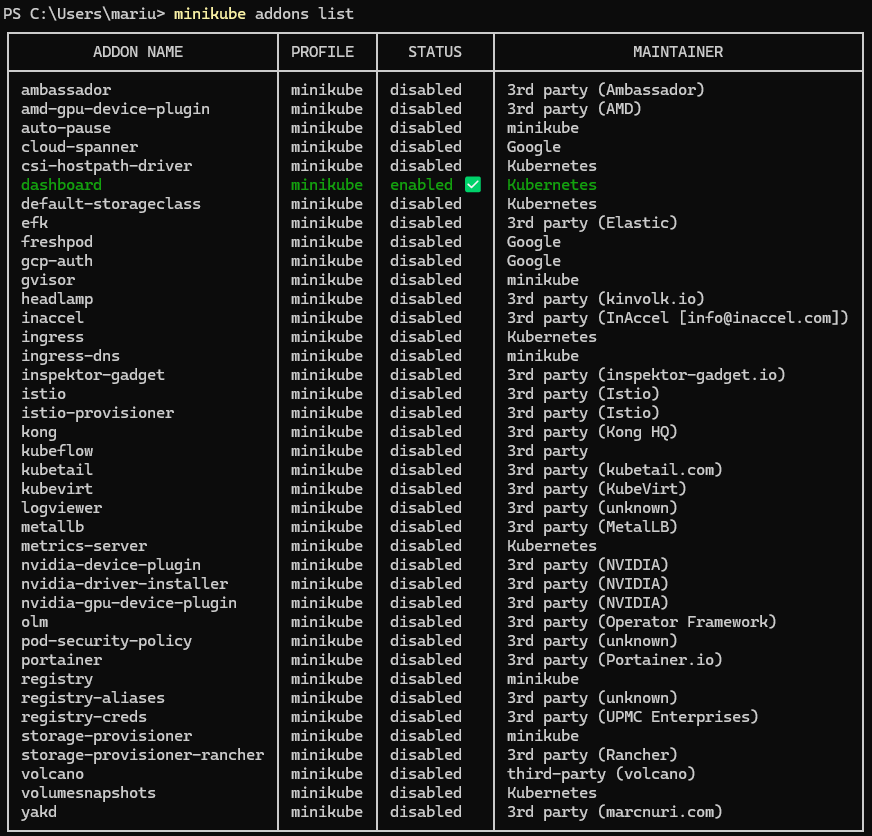</p>


---

### (3) Addon installé et justification

Nous avons activé **metrics-server**. Il expose les métriques CPU et mémoire des pods et des nœuds. C’est un prérequis utile pour le dashboard Kubernetes et pour l’observabilité avant l’installation de Linkerd à l’étape 2.

```text
$ minikube addons enable metrics-server
* Le module 'metrics-server' est activé
```


<p><strong>Question 3 — Activation de metrics-server</strong></p>
<p>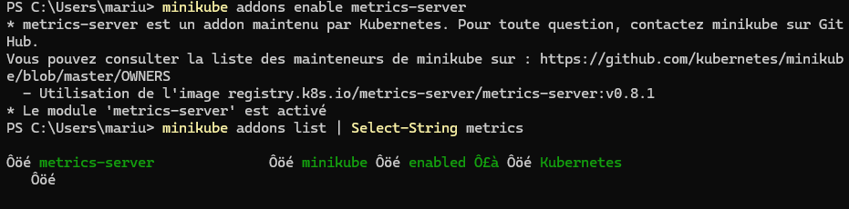</p>


---

### (4) Profils actifs et caractéristiques

```text
$ minikube profile list
│ PROFILE  │ DRIVER │ RUNTIME │      IP        │ VERSION │ STATUS │ NODES │ ACTIVE │
│ minikube │ docker │ docker  │ 192.168.49.2   │ v1.35.1 │ OK     │ 1     │ *      │
```

Le profil **minikube** est le seul profil actif : un nœud control-plane, Kubernetes v1.35.1, IP du cluster 192.168.49.2.


<p><strong>Question 4 — Profils Minikube et caractéristiques</strong></p>
<p>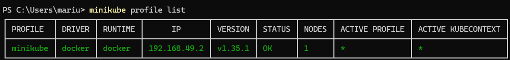</p>


---

### (5) Profils en cours

Le profil en cours est **minikube** (colonne ACTIVE PROFILE et contexte kubectl associé, marqués `*`).


<p><strong>Question 5 — Profil actif (minikube)</strong></p>
<p>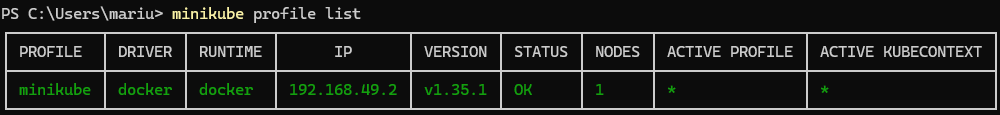</p>


---

### (6) Créer un profil — que représente-t-il ?

Un **profil Minikube** correspond à un **cluster Kubernetes isolé** sur la machine : configuration, nœuds, addons et contexte `kubectl` distincts. Cela permet par exemple de séparer un environnement de test (`dev`) d’un environnement de démonstration (`demo`).

Commande de création :

```bash
minikube start -p nom-du-profil --driver=docker
```

Nous n’avons pas créé de second profil permanent pour ne pas multiplier les ressources consommées sur Windows ; la procédure a été validée sur le profil `minikube` existant.

---

### (7) Statut de Minikube

```text
$ minikube status
minikube
type: Control Plane
host: Running
kubelet: Running
apiserver: Running
kubeconfig: Configured
```

Tous les composants du control-plane sont en état **Running**.


<p><strong>Question 7 — Statut Minikube</strong></p>
<p>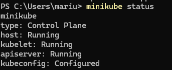</p>


---

### (8) Accéder au dashboard Minikube

```bash
minikube addons enable dashboard
minikube dashboard
```

La commande `minikube dashboard` ouvre un tunnel local vers le service `kubernetes-dashboard` dans le namespace `kubernetes-dashboard`. Sur notre installation, les services suivants ont été créés :

```text
kubernetes-dashboard        ClusterIP   10.103.224.207   80/TCP
dashboard-metrics-scraper   ClusterIP   10.102.255.212   8000/TCP
```


<p><strong>Question 8 — Accès au dashboard (URL)</strong></p>
<p>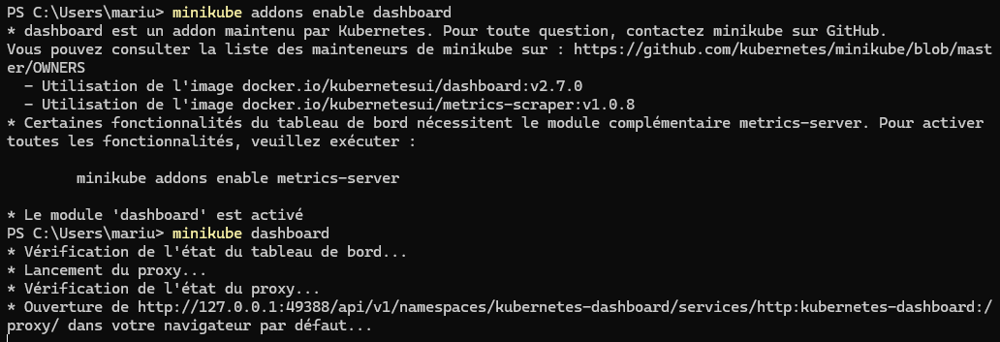</p>


---

### (9) Qu’est-ce que le Dashboard ?

Le **Kubernetes Dashboard** est une interface web fournie par le projet Kubernetes. Il permet de visualiser et piloter les ressources du cluster : pods, deployments, services, namespaces, logs, sans passer uniquement par la ligne de commande. Couplé à **metrics-server**, il affiche en plus des indicateurs de charge (CPU, mémoire). C’est un complément à `kubectl` et à l’addon **Lens** mentionné dans le polycopié.


<p><strong>Question 9 — Interface Kubernetes Dashboard</strong></p>
<p>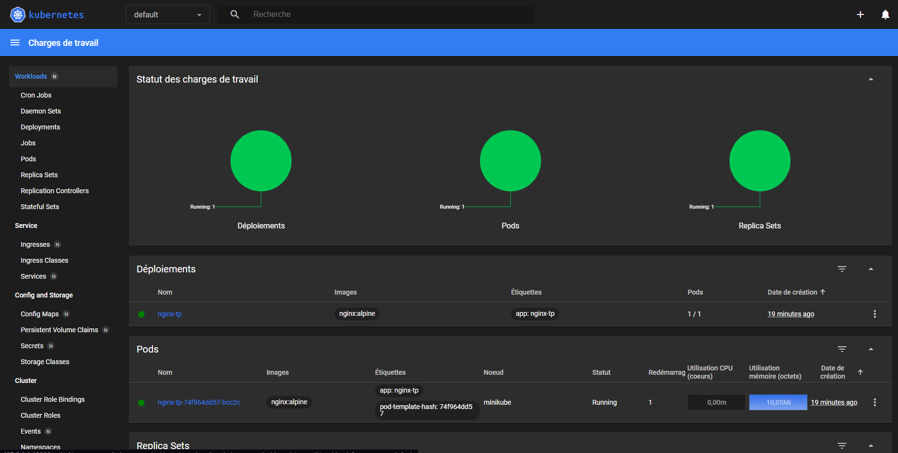</p>


---

### (10) Lister les nœuds du profil

```text
$ kubectl get nodes -o wide
NAME       STATUS   ROLES           AGE   VERSION   INTERNAL-IP    OS-IMAGE
minikube   Ready    control-plane   31m   v1.35.1   192.168.49.2   Debian GNU/Linux 12 (bookworm)
```

Un seul nœud **Ready**, rôle `control-plane`.


<p><strong>Question 10 — Liste des nœuds (kubectl get nodes)</strong></p>
<p>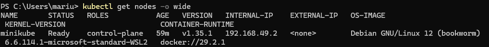</p>


---

### (11) Ajouter puis supprimer un nœud

**Ajout** :

```text
$ minikube node add -p minikube
* Ajout du nœud m02 au cluster minikube en tant que [worker]
* m02 a été ajouté avec succès à minikube !

$ kubectl get nodes
NAME           STATUS     ROLES           VERSION
minikube       Ready      control-plane   v1.35.1
minikube-m02   NotReady   <none>          v1.35.1
```

Le nœud worker **minikube-m02** est apparu ; il est passé par un état **NotReady** bref au démarrage (comportement normal sous Windows / driver Docker).

**Suppression** :

```text
$ minikube node delete minikube-m02 -p minikube
* Le nœud minikube-m02 a été supprimé avec succès.

$ kubectl get nodes
NAME       STATUS   ROLES           VERSION
minikube   Ready    control-plane   v1.35.1
```


<p><strong>Question 11 — Ajout et suppression d'un nœud</strong></p>
<p>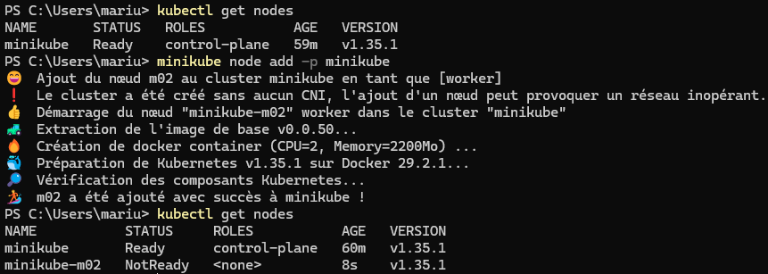</p>


---

### (12) Consulter les logs de Minikube

```bash
minikube logs
minikube logs --length=50
```

La commande `minikube logs` agrège les journaux des composants du cluster (apiserver, kubelet, addons, etc.). Elle sert au diagnostic en cas de démarrage bloqué ou d’addon défaillant. Nous l’avons utilisée après l’activation de metrics-server pour confirmer le déploiement du pod associé.


<p><strong>Question 12 — Logs Minikube</strong></p>
<p>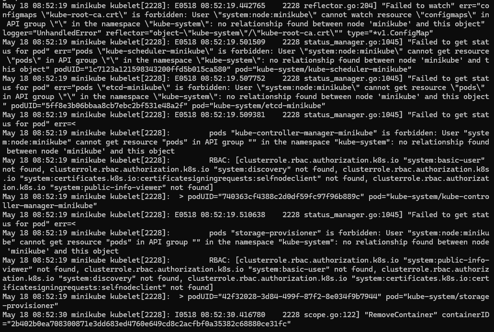</p>


---

## Gestion des pods et services

### (13) Images en exécution dans l’environnement Minikube

Après `minikube docker-env | Invoke-Expression` (PowerShell), la commande `docker ps` liste les conteneurs du **daemon Docker interne à Minikube** :

```text
NAMES                                          IMAGE                    STATUS
k8s_nginx_nginx-tp-...                         nginx                    Up
k8s_metrics-server_metrics-server-...          metrics-server           Up
k8s_coredns_coredns-...                        coredns                  Up
k8s_kube-apiserver_kube-apiserver-minikube_... kube-apiserver           Up
...
```

On y voit notamment l’image **nginx** du déploiement de test et **metrics-server** activé à la question (3).


<p><strong>Question 13 — Conteneurs Docker dans Minikube</strong></p>
<p>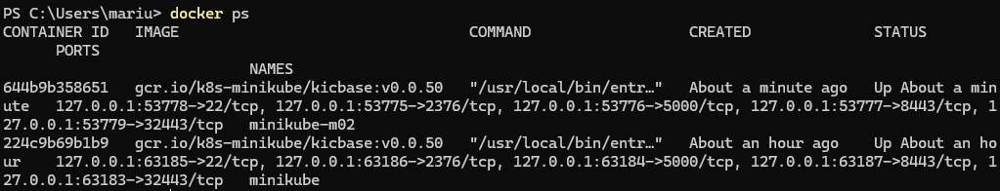</p>


---

### (14) Déployer nginx (mode impératif)

```bash
kubectl create deployment nginx-tp --image=nginx:alpine --replicas=1
```

```text
$ kubectl get pods
NAME                        READY   STATUS    RESTARTS   AGE
nginx-tp-74f964dd57-bcc2c   1/1     Running   0          2m
```


<p><strong>Question 14 — Déploiement nginx</strong></p>
<p>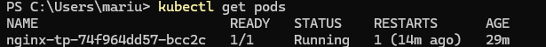</p>


---

### (15) Exposer nginx par un Service (mode impératif)

```bash
kubectl expose deployment nginx-tp --type=NodePort --port=80 --target-port=80
```

```text
$ kubectl get svc nginx-tp
NAME       TYPE       CLUSTER-IP     PORT(S)        AGE
nginx-tp   NodePort   10.109.49.73   80:30518/TCP   30s
```

Le service est exposé sur le **NodePort 30518**.


<p><strong>Question 15 — Service NodePort nginx</strong></p>
<p>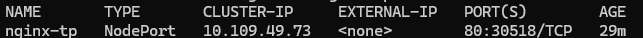</p>


---

### (16) Informations détaillées du pod et du service

```bash
kubectl describe deployment nginx-tp
kubectl describe svc nginx-tp
```

Éléments relevés :
- **Deployment** : 1 réplica, image `nginx:alpine`, stratégie RollingUpdate
- **Service** : type NodePort, port 80 → targetPort 80, NodePort **30518**, endpoint `10.244.0.4:80`


<p><strong>Question 16 — Description du service nginx</strong></p>
<p>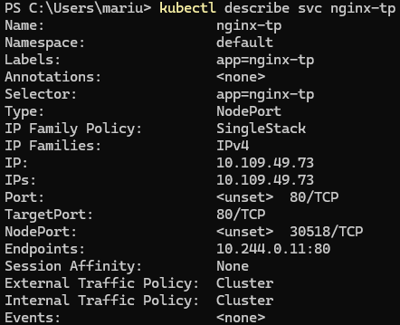</p>


---

### (17) URL du service

```text
$ minikube service nginx-tp --url
http://127.0.0.1:55971
```

Sous Windows avec le driver Docker, Minikube ouvre un tunnel local : l’URL pointe vers `127.0.0.1` avec un port dynamique. Le NodePort direct est accessible via `http://192.168.49.2:30518` (`minikube ip` + port du service).


<p><strong>Question 17 — URL du service nginx</strong></p>
<p>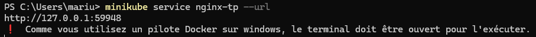</p>


---

### (18) Accès dans le navigateur

Nous avons ouvert l’URL fournie par `minikube service nginx-tp --url` dans le navigateur. La page par défaut **« Welcome to nginx! »** s’affiche, ce qui confirme que le Service route correctement vers le pod.

> Sous Windows, le tunnel `minikube service` nécessite de **laisser le terminal ouvert** le temps de la consultation (message affiché par Minikube).


<p><strong>Question 18 — Page nginx dans le navigateur</strong></p>
<p>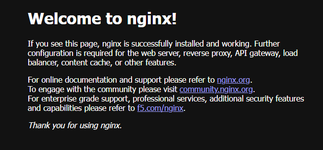</p>


---

### (19) Commande dans le conteneur nginx

```bash
kubectl exec nginx-tp-74f964dd57-bcc2c -- nginx -v
```

```text
nginx version: nginx/1.31.0
```

Pour un shell interactif : `kubectl exec -it nginx-tp-74f964dd57-bcc2c -- /bin/sh`


<p><strong>Question 19 — Commande exec dans le conteneur nginx</strong></p>
<p>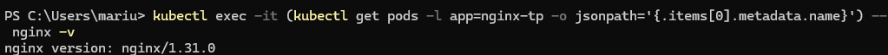</p>


---

### (20) Logs du conteneur nginx

```bash
kubectl logs nginx-tp-74f964dd57-bcc2c
```

Les logs montrent l’exécution du script d’entrée Docker officiel nginx (`/docker-entrypoint.sh`) et l’activation de la configuration par défaut. Aucune erreur n’apparaît après le démarrage.


<p><strong>Question 20 — Logs du pod nginx</strong></p>
<p>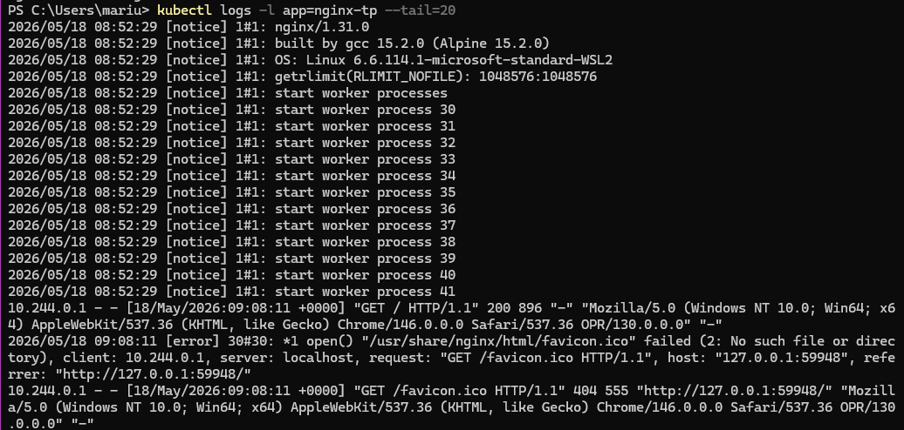</p>


---

## Arrêt de Minikube

```bash
minikube stop
```

Nous arrêtons le cluster une fois les manipulations terminées pour libérer les ressources machine.

---

## Partie Docker Build — service démo (`demo-service`)

Service REST Spring Boot : `GET /monservice/echo/{nom}`, `POST /monservice/hello`.

### Fat-JAR et build multi-stage

Nous avons construit l’image multi-stage **sans compilation Maven locale** :

```bash
cd demo-service
docker build -f Dockerfile.multistage -t demo-service:multistage .
```

Le build Maven s’exécute dans l’étape `build` ; l’image finale ne contient que le JRE 21 et le JAR. Durée du build Maven dans le conteneur : environ 33 secondes.

**Intérêt du multi-stage** : image de production plus légère, pas d’outils de build dans l’image finale, pipeline reproductible pour la suite du TP (LaboTrack sur Kubernetes).


<p><strong>Docker — Build multi-stage demo-service</strong></p>
<p>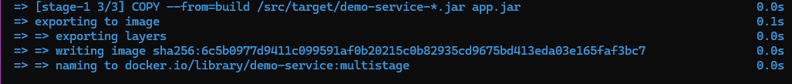</p>


<p><strong>Docker — Test curl du service démo</strong></p>
<p>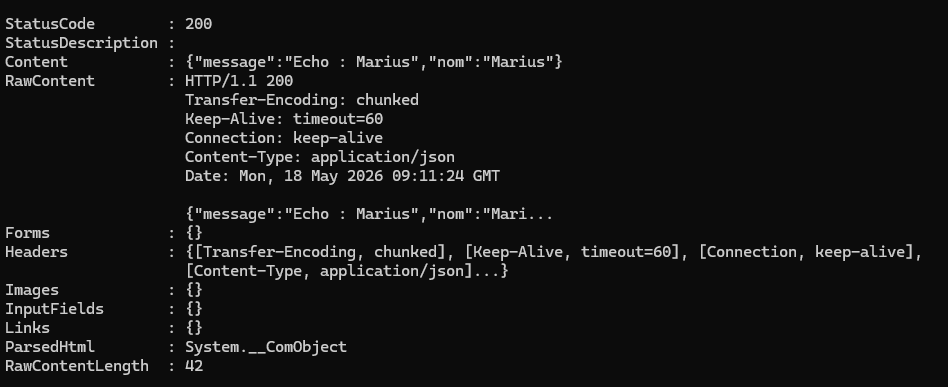</p>


---

## Nettoyage des ressources de test

```bash
kubectl delete deployment nginx-tp
kubectl delete service nginx-tp
```

---

## Note technique — PATH Minikube sous Windows

Minikube est installé dans `C:\Program Files\Kubernetes\Minikube`. Si la commande `minikube` n’est pas reconnue dans un nouveau terminal, ajouter ce dossier au PATH utilisateur ou lancer :

```powershell
$env:Path = "C:\Program Files\Kubernetes\Minikube;" + $env:Path
```
