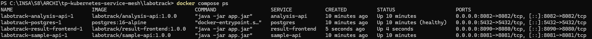
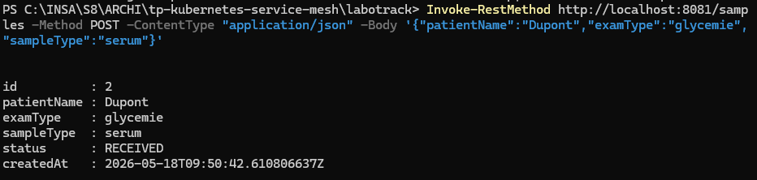
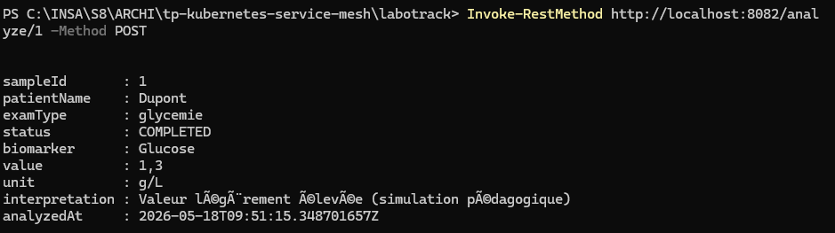

# Étape 2 — LaboTrack, Kubernetes & Service Mesh (Linkerd)

> **Énoncé officiel** : `docs/TP/tp_kubernetes (Services Mesh) 2026.pdf` (pages 2–5)

**Équipe** : Marius FRANCK (marius.franck@uphf.fr), Simon CARPENTIER (simon.carpentier@uphf.fr)  
**Date** : 18 mai 2026  
**Environnement** : Windows, Docker Desktop, Minikube (driver `docker`), Kubernetes, Linkerd

**LaboTrack** simule le parcours d’un échantillon biologique en laboratoire : enregistrement → analyse → restitution.

> Le service démo `/monservice/*` (Étape 1) est **distinct** de ce projet.

Les captures d’écran des manipulations locales (Docker Compose) sont intégrées ci-dessous.

> **Pour voir les images** : ouvrir l’**aperçu Markdown** avec `Ctrl+Shift+V` (pas l’éditeur brut).

---

## Tests locaux — Docker Compose

### Démarrage de la stack

```powershell
cd labotrack
docker compose up --build -d
docker compose ps
```

Quatre conteneurs doivent être `Up` : `postgres`, `sample-api`, `analysis-api`, `result-frontend`.

<p><strong>Démarrage Docker Compose — docker compose ps</strong></p>
<p></p>

---

### Création d’un échantillon (`sample-api`)

```powershell
Invoke-RestMethod http://localhost:8081/samples -Method POST `
  -ContentType "application/json" `
  -Body '{"patientName":"Dupont","examType":"glycemie","sampleType":"serum"}'
```

Réponse attendue : JSON avec `"id"`, `"status": "RECEIVED"`.

<p><strong>POST /samples — enregistrement d’un échantillon</strong></p>
<p></p>

---

### Lancement d’une analyse (`analysis-api`)

```powershell
Invoke-RestMethod http://localhost:8082/analyze/1 -Method POST
```

Réponse attendue : JSON avec `"status": "COMPLETED"`, biomarqueur et interprétation (latence simulée ~300 ms).

<p><strong>POST /analyze/1 — résultat d’analyse simulée</strong></p>
<p></p>

---

### Interface web

Frontend accessible sur [http://localhost:9080](http://localhost:9080) (port mappé dans `docker-compose.yml` pour éviter un conflit avec le port 8080).

---

## Architecture fonctionnelle

```text
Utilisateur (navigateur)
        │
        ▼
┌───────────────────┐
│  result-frontend  │  :8080  (NodePort / minikube service)
└─────────┬─────────┘
          │ REST (proxy serveur)
          ├──────────────────────┐
          ▼                      ▼
┌─────────────────┐    ┌─────────────────┐
│   sample-api    │    │  analysis-api   │  :8082
│     :8081       │◄───│  POST /analyze  │
└────────┬────────┘    └─────────────────┘
         │
         ▼
┌─────────────────┐
│   PostgreSQL    │
└─────────────────┘
         ▲
    Linkerd sidecar (mTLS, metrics, policies)
```

### Microservices (3 max.)

| # | Service | Rôle | API |
|---|---------|------|-----|
| 1 | **sample-api** | Réception / enregistrement | `POST /samples`, `GET /samples/{id}` |
| 2 | **analysis-api** | Traitement simulé | `POST /analyze/{id}` → appelle sample-api, résultat fictif (ex. glycémie) |
| 3 | **result-frontend** | Interface HTML | Créer sample, lancer analyse, afficher résultat |

**Base de données** : PostgreSQL (obligatoire, implicite dans l’énoncé).

**Détail analysis-api** : latence artificielle `~300 ms` (`Thread.sleep`) pour démontrer timeouts / retries Linkerd.

---

## Livrables attendus (énoncé)

| Livrable | Emplacement prévu |
|----------|-------------------|
| Schéma d’architecture | `docs/architecture-labotrack.md` ou image dans `docs/captures/` |
| Dockerfiles multi-stage (×3) | `labotrack/*/Dockerfile` |
| Commandes build & push | `scripts/build.sh`, `scripts/push.sh` |
| Manifests Kubernetes | `k8s/*.yaml` |
| RunBook (script bash) | `scripts/deploy.sh` (+ évent. `runbook.sh`) |
| Captures PDF / Markdown | `docs/captures/etape2/` |
| README avec noms équipe | `README.md` |

---

## 1. Build Maven

```bash
cd labotrack/sample-api && mvn clean package -DskipTests
cd ../analysis-api && mvn clean package -DskipTests
cd ../result-frontend && mvn clean package -DskipTests
```

---

## 2. Images Docker (multi-stage OCI)

Chaque module : **une commande** `docker build` compile les sources et produit l’image finale.

```bash
./scripts/build.sh
```

Images :

| Image | Port |
|-------|------|
| `labotrack/sample-api:1.0.0` | 8081 |
| `labotrack/analysis-api:1.0.0` | 8082 |
| `labotrack/result-frontend:1.0.0` | 8080 |

### Registry

Pousser vers une registry pour déploiement K8s classique :

- **Registry locale** (Minikube) : voir [doc registry privée](https://www.mytinydc.com/kubernetes-private-docker-registry/)
- **Docker Hub** : `docker tag` + `docker push`

```bash
eval $(minikube docker-env)    # option : images directement dans Minikube
./scripts/push.sh
```

---

## 3. Déploiement Kubernetes (Minikube)

```bash
./scripts/deploy.sh
```

Manifests :

```bash
kubectl apply -f k8s/namespace.yaml
kubectl apply -f k8s/postgres.yaml
kubectl apply -f k8s/sample-api.yaml
kubectl apply -f k8s/analysis-api.yaml
kubectl apply -f k8s/result-frontend.yaml
```

```bash
kubectl -n labotrack get pods,svc
kubectl -n labotrack wait --for=condition=ready pod -l app=postgres --timeout=120s
```

### Variables d’environnement

| Service | Variable | Valeur (cluster) |
|---------|----------|------------------|
| sample-api | `SPRING_DATASOURCE_URL` | `jdbc:postgresql://postgres:5432/labotrack` |
| analysis-api | `SAMPLE_API_URL` | `http://sample-api:8081` |
| result-frontend | `SAMPLE_API_URL` | `http://sample-api:8081` |
| result-frontend | `ANALYSIS_API_URL` | `http://analysis-api:8082` |

---

## 4. Tests API

```bash
kubectl -n labotrack port-forward svc/sample-api 8081:8081 &
curl -X POST http://localhost:8081/samples \
  -H "Content-Type: application/json" \
  -d '{"patientName":"Dupont","examType":"blood","sampleType":"serum"}'
curl http://localhost:8081/samples/1

kubectl -n labotrack port-forward svc/analysis-api 8082:8082 &
curl -X POST http://localhost:8082/analyze/1
```

### Interface web

```bash
minikube service result-frontend -n labotrack --url
```

Parcours : créer échantillon → analyser → voir résultat.

---

## 5. Linkerd — procédure complète (énoncé)

### 5.1 Préparer Minikube

```bash
minikube start --driver=docker --cpus=4 --memory=6144
minikube addons enable metrics-server
```

### 5.2 Installer CLI + pré-checks

```bash
linkerd version
linkerd check --pre
```

### 5.3 Installer Linkerd (CRDs + control plane)

```bash
linkerd install --crds | kubectl apply -f -
linkerd install | kubectl apply -f -
linkerd check
```

### 5.4 Injection & déploiement maillé

```bash
kubectl create namespace labotrack
kubectl annotate namespace labotrack linkerd.io/inject=enabled --overwrite
./scripts/deploy.sh

# Si déjà déployé sans injection :
kubectl -n labotrack rollout restart deploy/sample-api
kubectl -n labotrack rollout restart deploy/analysis-api
kubectl -n labotrack rollout restart deploy/result-frontend
```

Vérifier les sidecars (2/2 conteneurs par pod) :

```bash
kubectl -n labotrack get pods
linkerd -n labotrack check
```

### 5.5 Observabilité, ServiceProfile & policies

**mTLS** : automatique entre pods injectés.

**Métriques & dashboard** :

```bash
linkerd viz install | kubectl apply -f -
linkerd -n labotrack stat deploy
linkerd -n labotrack viz dashboard &
```

**ServiceProfile** (timeouts, retries) — exemple pour l’appel analysis → sample :

Fichier : `k8s/linkerd/serviceprofile-sample-api.yaml`

```yaml
apiVersion: linkerd.io/v1alpha2
kind: ServiceProfile
metadata:
  name: sample-api.labotrack.svc.cluster.local
  namespace: labotrack
spec:
  routes:
  - name: GET /samples/{id}
    condition:
      method: GET
      pathRegex: /samples/[^/]+
    timeout: 2s
    isRetryable: true
```

**ServerAuthorization** (zero-trust interne) — n’autoriser que analysis-api vers sample-api :

Fichier : `k8s/linkerd/serverauthorization.yaml`

```bash
kubectl apply -f k8s/linkerd/
```

**Tap** (debug trafic) :

```bash
linkerd -n labotrack tap deploy/analysis-api
```

### 5.6 Vérifier & diagnostiquer

```bash
linkerd check
linkerd -n labotrack stat deploy --from deploy/result-frontend
linkerd -n labotrack top deploy
```

### 5.7 (Option) Prometheus / Grafana

Stack d’observation complémentaire — non obligatoire.

---

## 6. Scénario de démonstration (soutenance)

1. Schéma architecture + rôle de chaque microservice
2. `kubectl get pods -n labotrack` — pods 2/2 (app + proxy)
3. Frontend : création sample + analyse
4. `linkerd stat` — latence, taux succès
5. ServiceProfile / retries (évoquer le sleep 300 ms)
6. Dashboard Viz — trafic inter-services
7. (Bonus) coupure sample-api → observation erreurs / retries

---

## 7. Docker Compose (dev local, hors K8s)

Voir la section [Tests locaux — Docker Compose](#tests-locaux--docker-compose) en tête de document (captures incluses).

```bash
cd labotrack
docker compose up --build -d
```

---

## Checklist validation Étape 2

- [ ] 3 microservices + PostgreSQL déployés
- [ ] `POST /samples`, `GET /samples/{id}`, `POST /analyze/{id}` OK
- [ ] Frontend : parcours complet
- [ ] Images buildées (multi-stage) et pushées (registry ou Minikube)
- [ ] Linkerd installé, injection active, `linkerd check` OK
- [ ] ServiceProfile appliqué
- [ ] ServerAuthorization appliqué
- [ ] Captures : pods, frontend, `linkerd stat`, dashboard
- [ ] RunBook `scripts/deploy.sh` exécutable
- [ ] Noms équipe dans README racine

---

## Captures

Manipulations locales Docker Compose : voir [Tests locaux — Docker Compose](#tests-locaux--docker-compose) (`01` à `03` dans `docs/captures/etape2/`).

Index complet : [captures/README.md](captures/README.md).

## Dépannage

| Problème | Piste |
|----------|-------|
| `ImagePullBackOff` | `minikube docker-env` + rebuild ; `imagePullPolicy: Never` ou push registry |
| DB connection refused | Attendre pod `postgres` Ready |
| 502 / connection refused inter-services | DNS K8s (`sample-api`, pas `localhost`) |
| Pas de sidecar (1/1) | Namespace annoté + rollout restart |
| mTLS / 403 après ServerAuthorization | Vérifier labels service accounts dans les policies |

## Fichiers du dépôt

- Code : `labotrack/*/`
- K8s : `k8s/`, `k8s/linkerd/`
- Scripts : `scripts/`
